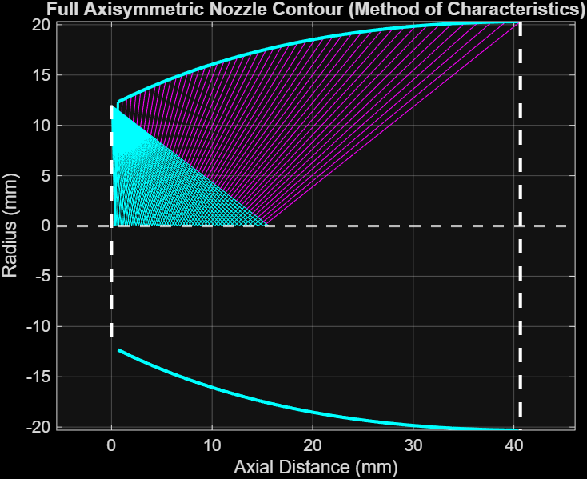

# 🚀 Method of Characteristics Bell Nozzle Design (MATLAB)

### Author: Jason Da Silva  
**Credits:** Characteristic-line formulation and base logic adapted from VDEngineering on YouTube! (2025)

---

## 🧠 Overview

This MATLAB program designs a **shock-free, minimum-length, axisymmetric bell nozzle** using the **Method of Characteristics (MOC)**.  
It computes the internal expansion region by tracing C⁺ and C⁻ characteristic lines, constructing a smooth wall contour that produces a **uniform, parallel exit flow**.

All generated wall coordinate points can be **exported and imported directly into SolidWorks** or other CAD software to generate a 3D nozzle model.

---

## ✨ Features

- Implements the **Method of Characteristics** for axisymmetric nozzle design  
- Generates **C⁺ and C⁻ characteristic lines** (visualized in blue)  
- Produces a **smooth parabolic bell contour**  
- Accepts user inputs for:
  - Chamber (stagnation) pressure `P0`
  - Ratio of specific heats `γ`
  - Throat radius `TR`
- Plots the nozzle shape and saves wall coordinates to Excel (`PARAMS.xlsx`)  
- Compatible with **SolidWorks**, **Fusion360**, or any CAD system

---

## 📂 Files

| File | Description |
|------|--------------|
| **`moc_bell_nozzle.m`** | Core MATLAB function computing the MOC bell nozzle contour |
| **`run_moc_nozzle_design.m`** | Main driver script prompting user input and executing the solver |
| **`PARAMS.xlsx`** | Output file containing wall and full nozzle coordinates (importable to CAD) |

---

## 🖥️ Usage Instructions

To run the Method of Characteristics Bell Nozzle Design program:


1. **Ensure the following files are in the same folder:**
   **`moc_bell_nozzle.m`**
   **`run_moc_nozzle_design.m`**

2. **Open MATLAB**, and in the **Current Folder** panel, navigate to the folder containing both files.  
Alternatively, you can set the path manually:
4. **Run the Driver** script in the MATLAB Command Window by typing:
   ```matlab
   >> run_moc_nozzle_design
   
5. **Enter** the required inputs when prompted:
   ```matlab
   === METHOD OF CHARACTERISTICS NOZZLE DESIGN ===
   Enter chamber pressure P0 [Pa]: (input here)
   Enter ratio of specific heats (gamma): (input here)
   Enter throat radius TR [mm]: (input here)
 
6. **View and save the results:**
   -The program will execute the MOC solver
   - Plot the bell nozzle contour
   - Automatically save wall-coordinate data to:

     **`PARAMS.xlsx`**
## 📈 Example Output

Below is an example of the bell nozzle contour generated by the MOC solver:




